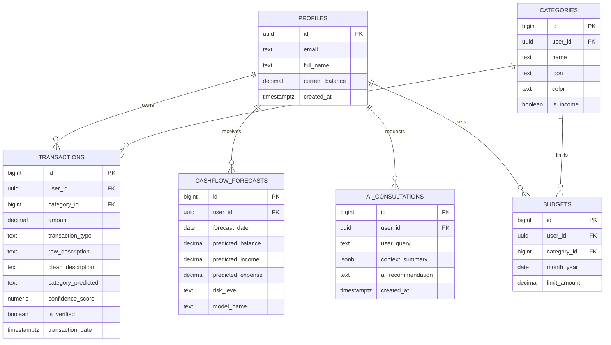

# BÁO CÁO KẾ HOẠCH TRIỂN KHAI ĐỀ TÀI VÀ ĐẶC TẢ HỆ THỐNG
## Đề tài 17: Hệ thống Quản lý Tài chính Cá nhân Dự báo Dòng tiền Thông minh (AI-driven Cash Flow Forecasting & Financial Management)

---

## 1. TỔNG QUAN DỰ ÁN (PROJECT OVERVIEW)

### 1.1. Bối cảnh & Vấn đề thực tế
Quản lý tài chính cá nhân là nhu cầu thiết yếu đối với người đi làm và sinh viên. Tuy nhiên, các giải pháp hiện nay trên thị trường (Money Lover, Spendee, Sổ Thu Chi...) đều tồn tại ba rào cản lớn:
1. **Nút thắt nhập liệu thủ công:** Người dùng phải tự tay nhập số tiền, chọn danh mục chi tiêu cho từng giao dịch. Hành vi chuyển khoản ngân hàng thường có nội dung ngắn gọn, không dấu hoặc viết tắt khiến việc tự động hóa gặp khó khăn.
2. **Thiếu khả năng nhìn về tương lai (Reactive vs. Proactive):** Hầu hết các ứng dụng chỉ thống kê lịch sử quá khứ ("tháng này đã tiêu bao nhiêu"), không thể trả lời câu hỏi cốt lõi: *"Với tốc độ chi tiêu này, liệu 10-20 ngày tới tài khoản có bị thâm hụt trước khi nhận lương không?"*.
3. **Chi phí & Độ trễ tích hợp AI:** Việc phụ thuộc hoàn toàn vào các mô hình ngôn ngữ lớn trên đám mây (Cloud LLMs như OpenAI GPT-4, Google Gemini) cho mọi tác vụ gán nhãn giao dịch gây ra độ trễ cao (>1-2s), chi phí đắt đỏ và dễ chạm giới hạn tần suất (rate-limit).

### 1.2. Giải pháp đề xuất: Kiến trúc Hybrid AI & Hệ thống Bất đồng bộ
Hệ thống giải quyết bài toán bằng cách kết hợp:
* **Kiến trúc AI phân tầng (Tiered Hybrid AI):**
  * *Tầng 1 (Local/Edge - Low Latency < 50ms):* Fine-tune mô hình ngôn ngữ nhỏ gọn tiếng Việt (PhoBERT) để gán nhãn tự động nội dung chuyển khoản và mô hình học sâu chuỗi thời gian (DLinear/LSTM) để dự báo số dư/dòng tiền 7–30 ngày.
  * *Tầng 2 (Cloud LLM - Reasoning Engine):* Gemini API đóng vai trò Chuyên gia tư vấn tài chính (Financial Advisor), chỉ kích hoạt khi fallback gán nhãn ca khó và phân tích thói quen, lập kế hoạch tiết kiệm chuyên sâu.
* **Hạ tầng Dữ liệu & Backend Hiện đại (Supabase & PostgreSQL):**
  * Sử dụng **Supabase Cloud (PostgreSQL)** làm cơ sở dữ liệu chính: hỗ trợ Row Level Security (RLS) bảo mật tuyệt đối cho dữ liệu tài chính từng người dùng, Realtime subscriptions, Auth đa phương thức và Auto-generated RESTful APIs.
* **Đa nền tảng (Cross-platform Flutter App):**
  * Ứng dụng client phát triển trên **Flutter (Dart)** hỗ trợ mượt mà trên Mobile (Android, iOS) và Web với kiến trúc Module hóa (Feature-first).

---

## 2. KẾ HOẠCH THỰC HIỆN CHI TIẾT THEO GIAI ĐOẠN

```
                  ┌─────────────────────────────────────────────────────────┐
                  │                 GIAI ĐOẠN 1: GIỮA KỲ                    │
                  │        Nghiên cứu, Huấn luyện & Bàn giao AI             │
                  └───────────────────────────┬─────────────────────────────┘
                                              │ Pipeline, Weights, Evaluated Models
                                              ▼
                  ┌─────────────────────────────────────────────────────────┐
                  │                 GIAI ĐOẠN 2: CUỐI KỲ                    │
                  │       Đóng gói App Flutter, Supabase & AI Backend       │
                  └─────────────────────────────────────────────────────────┘
```

### 2.1. GIAI ĐOẠN 1: GIỮA KỲ (Nghiên cứu & Thực nghiệm Mô hình AI)
* **Dataset:** Xây dựng tập dữ liệu 5,000 - 10,000 giao dịch ngân hàng thực tế (sao kê MBBank, Vietcombank, Techcombank...). Chuẩn hóa teencode, viết tắt, danh mục 8-10 nhóm chi tiêu.
* **NLP Model:** `vinai/phobert-base-v2` kết hợp LoRA (Parameter-Efficient Fine-Tuning) phân loại nội dung chuyển khoản tiếng Việt với F1-Score $\ge 88\%$. Fallback sang Gemini khi độ tin cậy thấp.
* **Time-Series Forecasting:** So sánh thực nghiệm ARIMA vs. LSTM/Bi-LSTM vs. DLinear để dự báo số dư và xu hướng thâm hụt 7 - 30 ngày.

### 2.2. GIAI ĐOẠN 2: CUỐI KỲ (Hệ thống Flutter App & Supabase BaaS)
* **Frontend:** Ứng dụng Flutter trực quan: Dashboard tài chính, quản lý thu/chi, cảnh báo thâm hụt và biểu đồ dự báo.
* **Database & BaaS:** Supabase PostgreSQL với đầy đủ RLS, Functions và Edge Triggers.
* **AI Service:** Tích hợp API dự báo dòng tiền và trợ lý tài chính thông minh Gemini.

---

## 3. THIẾT KẾ CƠ SỞ DỮ LIỆU & KIẾN TRÚC DỮ LIỆU (POSTGRESQL & SUPABASE)

Cơ sở dữ liệu được triển khai trực tiếp trên **Supabase PostgreSQL** với mô hình quan hệ chuẩn hóa và bảo mật đa tầng bằng **Row Level Security (RLS)**:



### Các bảng dữ liệu chính & Tính năng nâng cao:
1. `public.profiles`: Thông tin tài khoản người dùng, liên kết `auth.users`, ngày nhận lương `payroll_day` và số dư `current_balance`.
2. `public.categories`: Danh mục thu/chi (hỗ trợ phân loại mặc định và danh mục tùy chỉnh).
3. `public.transactions`: Lịch sử giao dịch, nội dung sao kê gốc, nhãn AI dự đoán và điểm tin cậy.
4. `public.budgets`: Quản lý hạn mức chi tiêu theo tháng cho từng danh mục.
5. `public.cashflow_forecasts`: Dữ liệu số dư, dòng tiền dự kiến 7 - 30 ngày từ mô hình AI (DLinear/LSTM).
6. `public.ai_consultations`: Lịch sử tư vấn tài chính thông minh tích hợp Google Gemini AI.
7. `public.notes`: Bảng kiểm tra kết nối nhanh giữa Flutter và PostgreSQL.

### Tối ưu hóa hiệu năng & Bảo mật:
* **Tối ưu RLS Policies:** Sử dụng biểu thức `(SELECT auth.uid())` giúp Postgres cache kết quả phiên đăng nhập, tăng tốc độ truy vấn từ 10x đến 100x so với gọi hàm lặp lại trên từng dòng.
* **Tự động hóa bằng Trigger:** Tự động tạo hồ sơ khi người dùng đăng ký (`on_auth_user_created`) và cập nhật thời gian sửa đổi `updated_at`.
* **Đánh chỉ mục (Indexing):** Toàn bộ khóa ngoại (`user_id`, `category_id`) và các trường lọc thường xuyên (`transaction_date`, `month_year`) đều được đánh index tối ưu.

> [!TIP]
> Toàn bộ script DDL, triggers và policies được lưu trữ tại: [`supabase/schema.sql`](file:///d:/Project1/supabase/schema.sql). Bạn có thể sao chép và dán trực tiếp vào **SQL Editor** trên Supabase Dashboard để kích hoạt ngay.

---

## 4. CẤU TRÚC KHO CHỨA MÃ NGUỒN (REPOSITORY STRUCTURE)

Dự án được cấu trúc theo mô hình **Feature-Driven Architecture** chuẩn mực cho ứng dụng Flutter và dịch vụ backend Supabase:

```text
Project1/
├── .agents/                          # Agent skills & workflows
├── android/                          # Cấu hình Native Android
├── ios/                              # Cấu hình Native iOS
├── web/                              # Cấu hình Web App
├── supabase/                         # Database Migration & Schema
│   └── schema.sql                    # Script DDL PostgreSQL & RLS Policies
├── lib/
│   ├── core/
│   │   ├── constants/
│   │   │   └── supabase_config.dart  # URL, API Keys & Supabase Client
│   │   ├── theme/
│   │   │   └── app_theme.dart        # Bảng màu tài chính & Typography (Material 3)
│   │   └── utils/
│   ├── models/
│   │   ├── category_model.dart       # Data model danh mục thu/chi
│   │   └── transaction_model.dart    # Data model giao dịch tài chính
│   ├── services/
│   │   └── supabase_service.dart     # Service đóng gói các câu lệnh truy vấn PostgreSQL
│   ├── features/
│   │   ├── dashboard/                # Màn hình tổng quan số dư, biểu đồ và kiểm tra kết nối
│   │   │   └── dashboard_screen.dart
│   │   ├── transactions/             # Quản lý nhập liệu, danh sách thu/chi
│   │   └── forecast/                 # Trực quan hóa dự báo dòng tiền
│   ├── supabase_config.dart          # Export tương thích cấu hình
│   └── main.dart                     # Điểm khởi chạy ứng dụng (Entry point)
├── test/
│   └── widget_test.dart              # Kiểm thử Widget tự động
├── pubspec.yaml                      # Khai báo thư viện (supabase_flutter, etc.)
└── README.md                         # Báo cáo đề tài & hướng dẫn dự án
```

---

## 5. HƯỚNG DẪN CÀI ĐẶT & CHẠY ỨNG DỤNG (GETTING STARTED)

### 5.1. Yêu cầu môi trường
* **Flutter SDK:** $\ge 3.24.0$ (Đã kiểm tra trên Flutter 3.41.x & Dart 3.11.x)
* **Tài khoản Supabase:** Miễn phí tại [supabase.com](https://supabase.com)

### 5.2. Các bước thiết lập

#### 1. Khởi tạo Database trên Supabase
1. Vào [Supabase Dashboard](https://supabase.com/dashboard) -> Tạo project mới.
2. Vào mục **SQL Editor**, dán toàn bộ nội dung từ file [`supabase/schema.sql`](file:///d:/Project1/supabase/schema.sql) và nhấn **Run** để khởi tạo cấu trúc bảng và RLS.

#### 2. Cấu hình Khóa API
Mở file [`lib/core/constants/supabase_config.dart`](file:///d:/Project1/lib/core/constants/supabase_config.dart) và đảm bảo các thông số chính xác:
```dart
class SupabaseConfig {
  static const String supabaseUrl = 'https://syjigvtyxfkmmqipxufm.supabase.co';
  static const String supabaseAnonKey = 'sb_publishable_gexOlWlrEdiPuyda9jixOA_cujZIIOX';
  ...
}
```

#### 3. Chạy ứng dụng
Cài đặt thư viện và khởi chạy trên Chrome hoặc Thiết bị mô phỏng:
```bash
# Tải các dependencies
flutter pub get

# Chạy ứng dụng (trên Chrome Web hoặc Device)
flutter run -d chrome
```

---

## 6. BẢNG PHÂN BỔ NHIỆM VỤ THỰC HIỆN TRONG NHÓM

| Thành viên | Trách nhiệm chính | Giai đoạn 1 (Giữa kỳ) | Giai đoạn 2 (Cuối kỳ) |
| :--- | :--- | :--- | :--- |
| **Thành viên 1** | Team Lead & AI Engineer | Xây dựng dataset, huấn luyện PhoBERT + LoRA phân loại giao dịch | Tích hợp Gemini Fallback & API Endpoint AI |
| **Thành viên 2** | Time-Series & Data Pipeline | Tiền xử lý chuỗi thời gian, huấn luyện ARIMA, LSTM & DLinear | Đóng gói pipeline dự báo dòng tiền 7-30 ngày |
| **Thành viên 3** | Backend & Database (Supabase) | Thiết kế Data Schema, đặc tả quan hệ thực thể | Triển khai PostgreSQL trên Supabase, viết RLS, Indexes |
| **Thành viên 4** | Mobile/Web Frontend (Flutter) | Thiết kế Wireframe giao diện, luồng người dùng | Xây dựng Flutter UI/UX, tích hợp Supabase SDK & Charts |

---

## 7. TIÊU CHÍ NGHIỆM THU (ACCEPTANCE CRITERIA)

* **NLP Model:** PhoBERT đạt F1-Score $\ge 88\%$ trên tập dữ liệu tiếng Việt; độ trễ suy luận $< 50\text{ms}$.
* **Time-Series:** Mô hình DLinear / LSTM đạt chỉ số MAPE tối ưu hơn mô hình truyền thống ARIMA.
* **Hệ thống Frontend & Backend:** Ứng dụng Flutter tương tác mượt mà với cơ sở dữ liệu Supabase PostgreSQL, bảo mật phân quyền theo từng User ID, phản hồi thời gian thực và đồng bộ dữ liệu đa nền tảng.
